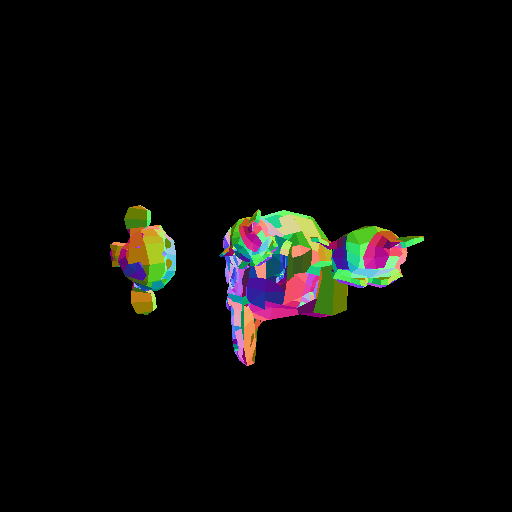
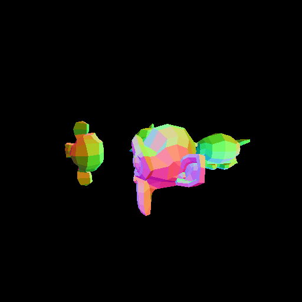
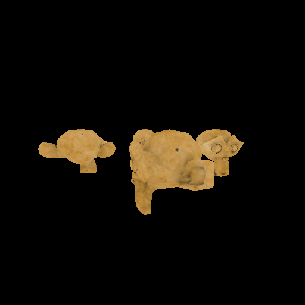
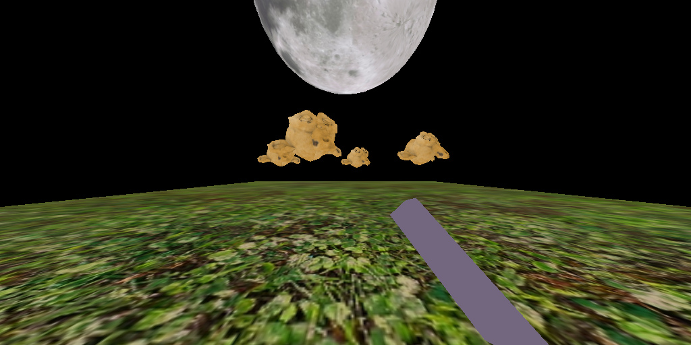
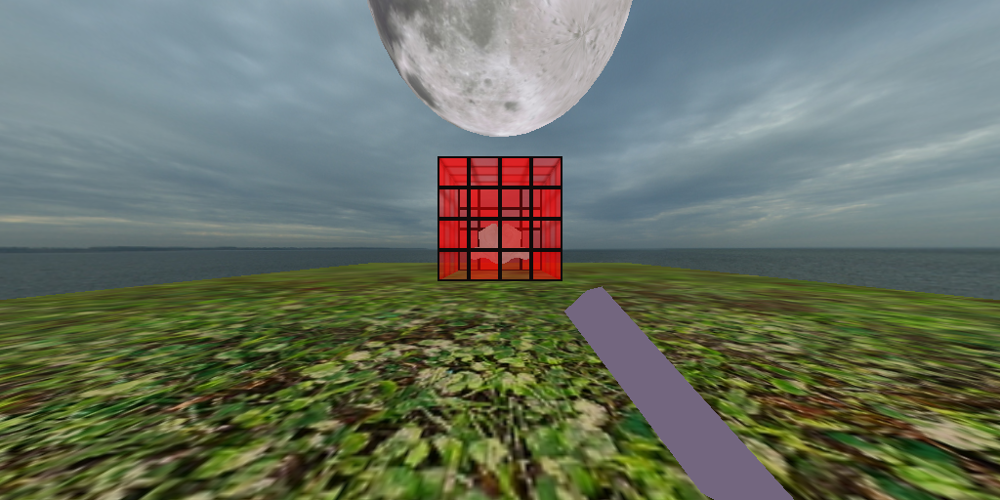
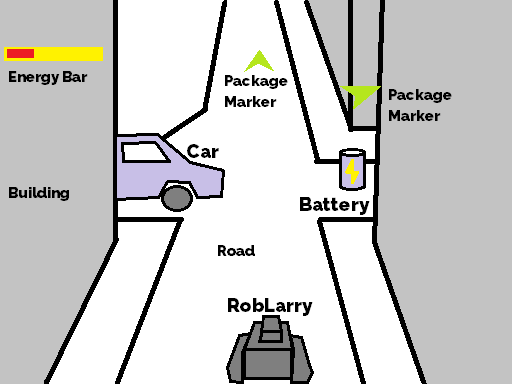
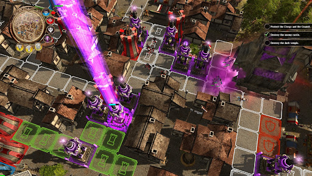
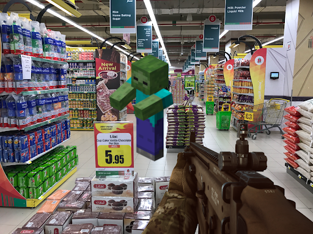

# CMP3060 Project Document

## Learning Outcomes

The goals of this project are to learn how to: 
1. Use buffers to store mesh data.
2. Use vertex array objects to render meshes.
3. Change an object's position, rotation and scale via matrices.
4. Use depth testing, face culling, blending and color/depth masks.
5. Use textures to draw images.
6. Use samplers to configure the texture sampling process.
7. Combine shaders, pipeline states and uniform data into a Material object.
8. Describe and process a scene using the Entity-Component-System ECS framework.
9. Implement a forward renderer with support for transparent objects.
10. Implement a lighting model and support multiple lights of different types.
11. Use the engine to implement a simple game. 

---

## Grading Notes

Please note that the main focus of the project is to apply graphics algorithms. The focus is not about art, game design, audio, etc. Don’t put too much effort in things that deviate from the main goal of the project.

Each student will be graded individually according to their contribution and understanding of the project. Each student is expected to understand all the covered topics about the rendering process using OpenGL.

For both phases, you should document your code in a clear and descriptive manner.

---

## Deadline Summary

* **Game Proposal:** Week 11 Saturday 30th April 2022 23:59.
* **Phase 2 Delivery:** Week 12 Saturday 7th May 2022 23:59.
* **Phase 2 Discussion:** During the tutorials in Week 12.
* **Phase 3 Delivery:** Week 14 Saturday 21st May 2022 23:59.
* **Phase 3 Discussion:** During the tutorial in Week 14.

---

# Phase 2

## Assets and Configurations

Other than code files, we have shader, model and texture files which are stored in the `"assets"` folder. We also have json configuration files inside the `"config"` folder.

The configuration files are split into folders based on the requirement they test. To allow testing each requirement in a batch, there are a set of scripts in the folder `"scripts"`. In addition, there is a script to run all the tests for all the requirements which is `"scripts/run-all.ps1"` and another script to compare all the outputs with the expected output which is `"scripts/compare-all.ps1"`.

---

## How to run

To compile the code, you need `CMake` and a `C++17` compiler. Thus, you **CANNOT** use an version of Visual Studio older than `Visual Studio 2017`. As alternatives, you can use `GCC 9` (or newer) or `CLang 5` (or newer).

If you are using `Visual Studio Code` with the `CMake Tools` extension, you should find the `GAME_APPLICATION.exe` inside the folder `bin`. You should run the executable using a terminal from the project folder where the execution command will be:

    ./bin/GAME_APPLICATION.exe

This will run the application using the default configuration file `config/app.json`. To run another configuration (e.g. `config\app.jsonc`), you should execute the command:

    ./bin/GAME_APPLICATION.exe -c='config/app.jsonc'

If you want the want the application to automatically close after a certain number of frames (e.g. 10 frames), you should run:

    ./bin/GAME_APPLICATION.exe -c='config/app.jsonc' -f=10

If you are working on Linux, remove the `".exe"` from the path for the executable.

To run all the configuration in sequence, you can run `scripts/run-all.ps1` on Powershell. You can select a certain subset of the configurations by setting the option `tests`. For example, to run all the sampler tests, you can run:

      ./scripts/run-all.ps1 -tests sampler-test

The screenshots should automatically be generated and added to the `screenshots` folder. Compare the results with the expected output from the folder `expected`. To compare the results, you can run `scripts/compare-all.ps1`. This script also supports the `tests` option similar to `scripts/run-all.ps1`.

If you have issues with running the scripts due to the execution policy, you could do the following to pypass it:

      powershell -executionpolicy bypass -file ./scripts/run-all.ps1
      powershell -executionpolicy bypass -file ./scripts/compare-all.ps1

---

## Requirements

For each the following requirements, you should write the code to solve the requirement and document your code in a clear and descriptive manner. You only need to modify the code at the locations marked as follows:

    \\TODO: .......

For this phase, you should not modify any code outside the requirement TODOs.

---

### Requirement 1: Mesh

The mesh is a collection of vertices and faces. In OpenGL, we define a mesh using 3 OpenGL objects:
- **Vertex Buffer**: which is a buffer that contains the data of all the vertices.
- **Element Buffer**: which is a buffer that contains data that defines the indices of the 3 vertices needed to draw each triangle (or 2 if lines or 1 if points). We will only handle the case of the triangles.
- **Vertex Array**: which is an object that defines how the data in the vertex buffer is interpreted and sent to the vertex shader as attributes.

In the code, there is a class "Mesh" which is defined in `source\common\mesh\mesh.hpp`. You will have some **TODOs** to finish before the class is fully functional.

The *Mesh* class is tested by the *MeshTestState* which is run by the configurations in `config\mesh-test`. If your implementation of *Mesh* is correct, your outputs should match the expected outputs.

---

### Requirement 2: Transform

To draw different instances of a mesh at different positions, orientations and/or scales, we send a transformation matrix to the vertex shader as a uniform. The transformation matrix is used to transform the vertex positions from the object's local space to the world space.

Since matrices are not human friendly (not trivial to edit by hand), we store transformations in the files (as seen in `config\transform-test`) using 3 vectors:
- **Position** which represents the object translation along the **x**, **y** and **z** axes. The default value is (0, 0, 0).
- **Rotation** which represents the object rotation around its origin. The x, y & z values represents euler angles which are the rotation angles around the x, y & z axes respectively. The order of rotation is around z (roll), then around x (pitch) and finally around y (yaw). The default value is (0, 0, 0).
- **Scale** which defines the scale along each axis. The default value is (1, 1, 1).

We use a struct "Transform" to store these three vectors and during rendering, we should convert it to a 4x4 Matrix. *Transform* is defined in `source\common\ecs\transform.hpp` and `source\common\ecs\transform.cpp` and you will have some **TODOs** to finish before the struct is fully functional. You also have a **TODO** in `assets\shaders\transform-test.vert`.

**IMPORTANT NOTE**: In the configuration files, we store the rotation angle in degrees but we convert them to radians during deserialization. So, you don't need to convert them to radians by yourself.

The *Transform* struct is tested by the *TransformTestState* which is run by the configurations in `config\transform-test`. If your implementation of *Transform* is correct, your outputs should match the expected outputs.

---

### Requirement 3: Pipeline State

OpenGL is a state machine where the options we pick are stored in the OpenGL context and affect the upcoming draw calls. Since each object may require different options while drawing (e.g. transparent objects require blending while Opaque objects don't), we would need to store the options for each object in a data structure and set the OpenGL options to match the given options before drawing.

This is where we use the "PipelineState" structure which we will use to store the depth testing, face culling, blending and color/depth mask options. The `setup` function of the *PipelineState* sets the OpenGL options to match the ones stored in the corresponding *PipelineState* instance.

The *PipelineState* struct is defined in `source\common\material\pipeline-state.hpp` and `source\common\material\pipeline-state.cpp`. You will have some **TODOs** to finish before the struct is fully functional.

The *PipelineState* struct is tested by the *PipelineTestState* which is run by the configurations in `config\pipeline-test`. If your implementation of *Pipeline* is correct, your outputs should match the expected outputs.

---

### Requirement 4: Texture

A 2D Texture is a sampleable storage containing a 2D array of pixels. By "sampleable", we mean that we can sample a color from it in the shaders.

In the code, there is a class "Texture2D" which is defined in `source\common\texture\texture2d.hpp`. You will have some **TODOs** to finish before the class is fully functional. To load a texture from an image file, you will find a `loadImage` function defined in `source\common\texture\texture-utils.hpp` and `source\common\texture\texture-utils.cpp`. You will have some **TODOs** to finish before the class is fully functional. There is also a **TODO** inside the function `empty` function which will be needed in **Requirment 10**.
Finally, you will need to finish the fragment shader `assets\shaders\texture-test.frag`.

The *Texture* class and *loadImage* function are tested by the *TextureTestState* which is run by the configurations in `config\texture-test`. If your implementation of *Texture2D* and *loadImage* is correct, your outputs should match the expected outputs.

---

### Requirement 5: Sampler

There are more than one way to sample a texture. For example, we can choose between nearest or linear filtering and we can select between different wrapping options. A sampler is an OpenGL object that can store the sampling options to use while sampling a texture.

In the code, there is a class "Sampler" which is defined in `source\common\texture\sampler.hpp` and `source\common\texture\sampler.cpp`. You will have some **TODOs** to finish before the class is fully functional.

The *Sampler* class is tested by the *SamplerTestState* which is run by the configurations in `config\sampler-test`. If your implementation of *Sampler* is correct, your outputs should match the expected outputs.

---

### Requirement 6: Material

In the previous phase and the previous requirements, we learned about shaders, pipeline states, textures and samplers. We also learned how to use them to define how an object should be drawn and how it will look. Now we want to combine all of that into one class which we will call "Material".

In our engine, a material answers the following questions:
- Which shader will be used to draw the object?
- Which pipeline state will be set before drawing the object?
- What uniform values will be sent to the shaders before drawing the objects? (This does not include the transformation matrix which is stored separately).
- Is this material transparent? (this will be useful for sorting in the last requirement "Forward Renderer").

Since there are lots of different types of Materials, we chose to create a base class for all materials (which we call "Material") and we inherit from it to create more specific materials (e.g. "TintedMaterial" and "TexturedMaterial").

You will find the base class "Material" and the two derived classes "TintedMaterial" and "TexturedMaterial" defined in `source\common\material\material.hpp` and `source\common\material\material.cpp`. You will have some **TODOs** to finish before the class is fully functional. You will also need to finish the followings shaders:
- `assets\shaders\tinted.vert` & `assets\shaders\tinted.frag`
- `assets\shaders\textured.vert` & `assets\shaders\textured.frag`

The *Material* classes are tested by the *MaterialTestState* which is run by the configurations in `config\material-test`. If your implementation of *Material* is correct, your outputs should match the expected outputs.

---

### Requirement 7: Entities and Components

Now, we want to organize our code in a form that would allow us to easily extend our application. To do this, we will implement an entity-component-system framework.

An entity-component-system ECS framework consists of 3 parts:
- **Entities**: which are containers that contain a set of components. An entity does nothing more than being a simple container and ideally, it should contain no logic of its own.
- **Components**: which are data objects that can be added to entities. The rolea and the data of the entities are defined by their components. For example, if an entity contains a camera component, then it is a camera and we should be able to find camera specific data (e.g. field of view angle) inside the camera component. In ECS, components should have no logic (only data is allowed) but we are not going to stick with this rule for simplicity.
- **Systems**: which defines the logic. For example, if we want to render a set of entities, we should implement a renderer system that draws the entities every frame.

For the sake of organization, we will add one more class called "World" which is a container of entities. And to keep the code simple, we will define the entity transformation directly inside the entity class (instead of defining a transform component). The entity transformation will be specified by: `localTransform` which defines the entity's transformation relative to its parent and `parent` which defines the entity's parent (or null if the entity is a root).

In this requirement, we will focus on 3 classes:
- **Entity** class which is defined in `source\common\ecs\entity.hpp` and `source\common\ecs\entity.cpp`.
- **CameraComponent** class which is defined in `source\common\components\camera.hpp` and `source\common\components\camera.cpp`. This specifies that its owning entity in a camera and contains the data needed to construct the camera projection matrix (except the aspect ratio which is computed using the window size). This component does not store any data about the camera position or orientation since it can be retrieved from the owning entity. 
- **MeshRendererComponent** class which is defined in `source\common\components\mesh-renderer.hpp` and `source\common\components\mesh-renderer.cpp`. This specifies that its owning entity is a drawable object. This class contains the material and the mesh used to draw this object.

Both the *Entity* and the *CameraComponent* classes contains **TODOs** that should be finished. Then go to the "EntityTestState" and finish the available **TODOs**. The *EntityTestState* is run by the configurations in `config\entity-test`. If your implementation of the TODOs is correct, your outputs should match the expected outputs.

---

### Requirement 8: Forward Renderer System

Finally, we want to isolate the rendering code into a separate system. The "ForwardRenderer" system class is defined in `source\common\systems\forward-renderer.hpp`. You will have some **TODOs** to finish before the class is fully functional.

The difference between the implementation of the forward renderer system and the previous requirement is that the forward renderer will handle the transparent objects by sorting them by the distance along camera forward direction. The draw order of transparent objects is from far to near.

**NOTE:** We called this system a forward renderer since it uses forward rendering (which is what we were learning during the tutorials). There are more complex rendering techniques such as deferred rendering, light pre-pass rendering and tiled/clustered forward rendering which are outside the scope of this project.

The *ForwardRenderer* class is tested by the *RendererTestState* which is run by the configurations in `config\renderer-test`. If your implementation of *ForwardRenderer* is correct, your outputs should match the expected outputs.

### Requirement 9: Sky Rendering

A background that is a single color is boring. We want to modify the "ForwardRenderer" system class (defined in `source\common\systems\forward-renderer.hpp`) to draw a sky sphere around the camera. You will have some **TODOs** to finish in order to render the sky.

A couple of notes about rendering skies:
* While we could render the sky before everything, we will choose not to for performance reasons. Instead, we will draw it after rendering the opaque objects and before rendering the transparent objects. Can you guess why?
* The sky should never occlude any other object so we should make sure that it is rendered as the farthest object in the scene. We can acheive that by modifying the transformation matrix to ensure that the `z = 1` for every pixel of the sky in the Normalized device coordinates space. How?

Sky rendering is implemented the *ForwardRenderer* class which is tested by the *RendererTestState*. To test the sky, run the configurations in `config\sky-test`. If your implementation of *ForwardRenderer* is correct, your outputs should match the expected outputs.

### Requirement 10: Postprocessing

Sometimes, we want to apply an image effect on the rendered scene. This is called postprocessing which can be applied by rendering the scene to a texture and then render the texture to the screen using the effect shader. We want to modify the "ForwardRenderer" system class (defined in `source\common\systems\forward-renderer.hpp`) to render the scene to a framebuffer (containing a color and a depth target), then render the color target to the screen using one of the postprocessing shaders. You will have some **TODOs** to finish in order to apply postprocessing effects. Don't forget to finish the **TODO** inside the function `empty` which you can find in `source\common\texture\texture-utils.cpp`. In addition some postprocessing shaders (`assets\shaders\postprocess\vignette.frag` and `assets\shaders\postprocess\chromatic-aberration.frag`) are incomplete, so you will need to finish them.

Postprocessing is implemented the *ForwardRenderer* class which is tested by the *RendererTestState*. To test the sky, run the configurations in `config\sky-test`. If your implementation of *ForwardRenderer* is correct, your outputs should match the expected outputs.

---

### Summary

This is a list of the requirements with their corresponding files:
1. Mesh
      * `source\common\mesh\mesh.hpp`
2. Transform
      * `source\common\ecs\transform.cpp`
      * `assets\shaders\transform-test.vert`
3. Pipeline State
      * `source\common\material\pipeline-state.hpp`
4. Texture
      * `source\common\texture\texture2d.hpp`
      * `source\common\texture\texture-utils.cpp`
      * `assets\shaders\texture-test.frag`
5. Sampler
      * `source\common\texture\sampler.hpp`
6. Material
      * `source\common\material\material.cpp`
      * `assets\shaders\tinted.frag`
      * `assets\shaders\textured.frag`
7. Entities and Components
      * `source\common\ecs\entity.cpp`
      * `source\common\components\camera.cpp`
      * `source\states\entity-test-state.hpp`
8. Forward Renderer
      * `source\common\systems\forward-renderer.hpp`
9. Sky Rendering
      * `source\common\systems\forward-renderer.hpp`
10. Postprocessing
      * `source\common\systems\forward-renderer.hpp`
      * `source\common\texture\texture-utils.cpp`
      * `assets\shaders\postprocess\vignette.frag`
      * `assets\shaders\postprocess\chromatic-aberration.frag`

The following diagram shows the relationship between the classes (and structs) in the project:

## Delivery

Phase 2 should be delivered on Saturday 7th May 2022 23:59 and discussed in the tutorial during Week 12.

The delivered files should only include the modified files. Only one member of each team needs to deliver the project on blackboard.

# Phase 3 (Final Phase)

The goal of this phase is to deliver a simple game implemented using the framework implemented in the previous phases.

## Requirment 1: Lighting

Since we already have an ECS framework with a forward renderer, we want to add lighting support to it. To do this, we should do the following:
1. Create a light component. The component will identify that the entity is a light and will contain all the data related to the light (e.g. color, type, cone angles) except the position and the direction which should be calculated from the entity component.
2. Add support for lighting in the shaders.
3. Create a lit material class that includes all the needed texture maps (albedo, specular, roughness, ambient occlusion, emission).
4. Add support for lighting in the forward renderer.

The renderer and the shaders should support having more than one light affecting the same object and these lights can have different parameters (types, positions, color, etc).

## Requirment 2: Game

In this requirement, we implement a game using the render engine we already built. The game must satisfy the following requirments:
* Usage of 3D models (created using any modeling program or downloaded from the internet).
* Lighting with multiple lights in the scene.
* Texture mapping (for models, environment, … etc.) with support for different texture types in lit materials (albedo, specular, roughness, etc).
* A sky.
* At least one postprocessing effect that we was not implemented or provided in Phase 2.
* 3D motion.
* Any form of collision detection in 3D (obstacles, ray-picking, etc).
* Game logic (some form of game-like user interaction with the world where the player has to work towards one or more goals).
* Scene Deserialization (All scenes should be defined in external data files. No scene data should be hard coded).
* More than one state (e.g. a menu state and a play state).

**NOTE:** you are allowed to use external libraries for functionalities that are not related to rendering. For example, you can use a physics engine to support collisions and physics, and if youn wish to add audio, you can use an audio library.

## Game Proposal Document

By Week 11 Saturday 30th April 2022 23:59, you should submit a game proposal. It should contain a game name, a paragraph describing the game and an image demonstrating the game idea. The description should describe how the game will be played and what is the goal of the game. Don’t forget to add the team member names, IDs and team number. Some example proposals are included in the appendix. Only one member of each team needs to deliver the game proposal on blackboard.

## Delivery

With Phase 3, you have to submit a PDF report that contains the following:
1. The names and IDs of the team members.
2. The contribution of each member in the project.
3. Three screenshots of your game.

Phase 3 should be delivered on Saturday 21st May 2022 23:59 and discussed in the tutorial during Week 14.

You should deliver all the project files except the `"bin"` and `"build"` folders. Including any of these 2 folders will cause your project to be penalized. Only one member of each team needs to deliver the project on blackboard.

# Appendix

## Proposal Examples

---

### Lamazone Delivery Service
Lamazone online shopping service has built the perfect delivery robot, a robot that can never stop moving. You play as a RoboLarry who is new to the job and has to finish his daily delivery quota. Your battery is limited and you can only hold one package at a time. Go to storage locations to take a package and deliver them to their corresponding customers. Steer left and right to avoid hitting buildings and moving cars and collect batteries on the road to recharge. Beware, the more energy you have, the faster you’ll move.

<code>Example Image (Drawn in Paint)</code>

---

### Towers of the Demon Lord

The army of light is approaching the city of the demon lord so he hires you, the underworld engineer, to build him a defense system against them. Add turrets, traps, and other obstacles to stop them from reaching the demon lord’s castle. Collect coins from dead knights to buy more tools and materials.

<code>Example Image (Photo from Defenders of Ardania)</code>

---

### Nice Day to Die Again

It was a nice day so you went shopping with your friends. Unfortunately, the zombies thought it was a nice day to go shopping too. Use your machine gun to make sure they are dead again. Get all the shopping items you want and get to the cashier without allowing any zombie to bite you. Shoot them if they get near you.

<code>Example Image: (Assembled together in GIMP)</code>

---

## Useful Resources

* Tutorials
    * [Learn OpenGL](https://learnopengl.com/)
    * [Open.GL](https://open.gl/introduction)
    * [OpenGL-Tutorial](http://www.opengl-tutorial.org/)
    * [The Book of Shaders](https://thebookofshaders.com/)
* References
    * [OpenGL Wiki](https://www.khronos.org/opengl/wiki/)
    * [OpenGL Reference](https://www.khronos.org/registry/OpenGL-Refpages/gl4/)
    * [docs.GL](https://docs.gl/)